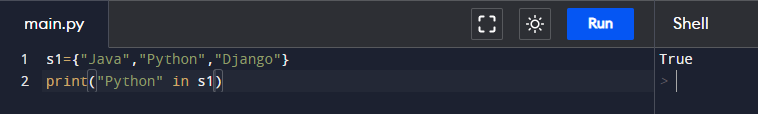

# Assignment - 17 Full Stack Web Development using Python MySirG Set

    Qns 1. Write a python program to store all the programming languages known to you using Set.

    Ans.

    Qns 2. Write a python program to store your own information {name, age, gender, so on..}

    Ans.

    Qns 3. Write a python script to get the data type of a Set.

    Ans.

    Qns 4. Write a Python script to find if “Python” is present in the set 
    thisset= {"Java", "Python", "Django"}

    Ans.

    Qns 5. Write a python program to add items from another set to the current set. 
    thisset = {"Java", "Python", "SQL"}
    secondset= {"C", "Cpp", "NoSQL"}

    Ans.

    Qns 6. Write a python program to add elements of list to a set
    thisset = {"Python", "Django", "JavaScript"}
    mylist = ["Java", "C"]

    Ans.

    Qns 7. Write a python program to remove last item of the given set
    thisset = {"Python", "Django", "JavaScript", “SQL”}

    Ans.

    Qns 8. Write a python program to delete the set completely.

    Ans.

    Qns 9. Write a python program to loop through the set and print values
    thisset = {"Python", "Django", "JavaScript", “SQL”}

    Ans.

    Qns 10. Write a python program to find the maximum and minimum value in a set.

    Ans.
